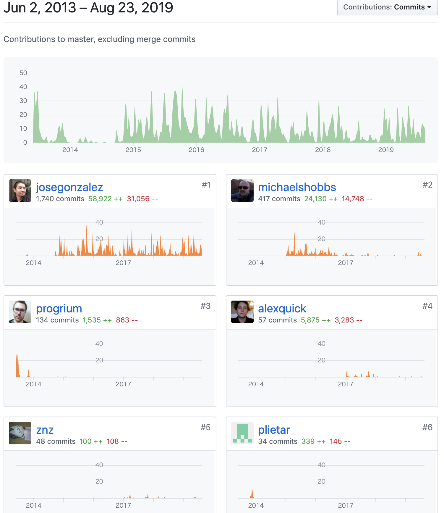
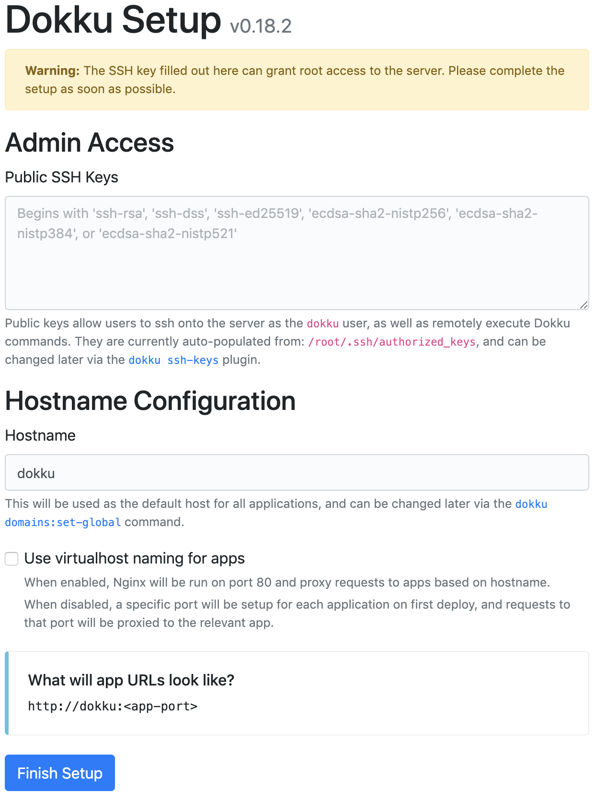

# Dokku の紹介

author
:   Kazuhiro NISHIYAMA

content-source
:   Docker Meetup Kansai #4 (19.08)

date
:   2019/08/23

allotted-time
:   5m

theme
:   lightning-simple

# 自己紹介

- Ruby コミッター
- https://github.com/dokku/dokku/graphs/contributors で #5 (2019-08 現在)

# contributors

{:relative_height='100'}

# Dokku とは?

- <http://dokku.viewdocs.io/dokku/>
- The smallest PaaS implementation you've ever seen
- mini-Heroku といっていたこともあった

# 向いているもの

- 1 台のサーバーで収まるアプリに向いている
- buildpacks を使っているので規模が大きくなったときに Heroku などのクラウドに移行しやすい
- データベースなどは別サーバーでも良い (Heroku と同様)

# 向いていないもの

- 複数台にまたがるスケールアウト
  - ロードバランサーとか別途用意する必要がある?
- ロールバックを考慮した運用
  - イメージにタグをつければ可能だが標準では古いイメージは気にしない
  - git reset で戻すような運用よりも git revert で積んでいくような運用に向いている

# 動作環境

- x64 の Ubuntu, Debian, CentOS, Arch
  - こだわりがなければ Ubuntu がオススメ
- Dokku 専用の VM を用意
  - 動作をわかっていないと nginx や docker を他のものと共有するのは難しい
  - メモリは 1GB 以上 (少ないとアプリのビルドに失敗するなどのトラブルの原因に)

# インストール

- bootstrap.sh で docker も含めてインストール
- Azure, DigitalOcean, ConoHa などはテンプレートあり

# Web UI から初期設定

{:relative_height='100'}

# 初期設定項目

- ssh の公開鍵を登録
- ホスト名設定
- サブドメインを使うか、アプリごとのポートを使うか
  - hello.example.com, test.example.com
  - example.com:48890, example.com:21835

# アプリのデプロイ

- データベースを使わないアプリなら git push するだけ (Heroku と同様)
- データベースを使うアプリならアプリを作成してデータベースとリンク
- buildpacks 以外に Dockerfile にも対応

# https 設定

- dokku-letsencrypt プラグインで自動設定
  - ダウンタイムなしで更新可能
  - 自動更新も可能
  - wildcard は未対応 (DNS との連携が必要なので難しい)
- CRT と KEY を用意して `dokku certs:add` で設定

# 更新

- `sudo dokku-update` ですべて更新
  - yaourt (arch), apt-get (debian, ubuntu), (centos, opensuse では何もしない)
  - プラグインの更新
  - `dokku ps:rebuildall` でアプリのリビルド

# まとめなど

- Dokku を使えば Heroku のように git push だけで更新できる PaaS を自前で構築できる
- 前の会社では社内向け Rails アプリを動かすのに使っていた
- 今は自分専用の Rails アプリを動かすのに使っている
